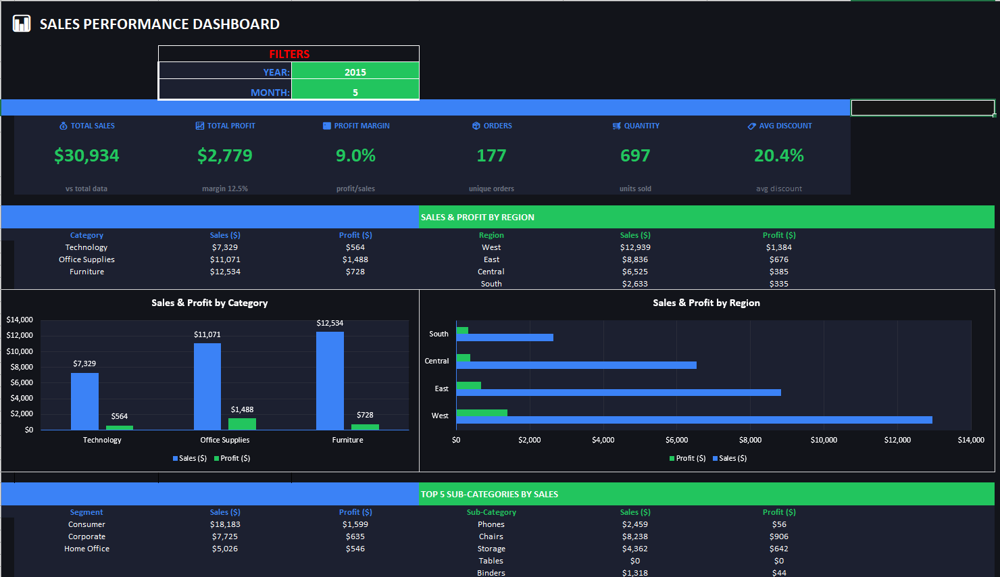

# 📊 Sales & Profit Dashboard – Superstore Analysis

An interactive dashboard built to analyze sales and profit for a retail-style business, with dynamic **Year** and **Month** filters, key KPIs, and breakdowns by category, region, and customer segment.

> 📁 Dataset: Sample Superstore (simulated data, not a real company)
> 🛠️ Tools: Power BI / DAX / Excel *(update with whatever you actually used)*

---

## 🎛️ Filters (Year / Month)

The dashboard is built around two dynamic filters: **Year** and **Month**.
All KPIs, tables, and charts update automatically based on the selection — simulating a real reporting environment where stakeholders need to slice data by time period without touching the raw data.

---

## 📌 KPI Cards – The Business Pulse

The 6 KPI cards at the top give an instant health check of the business for the selected period:

| KPI | Why It Matters |
|-----|-----------------|
| **Total Sales ($52,268)** | Top-line revenue — answers "how much did we sell?" |
| **Total Profit ($8,256)** | Bottom-line — answers "how much did we actually make?" |
| **Profit Margin (15.8%)** | Efficiency metric — are we selling profitably? |
| **Orders (236)** | Volume metric — how active is the customer base? |
| **Quantity (926)** | Operational metric — useful for inventory & logistics |
| **Avg Discount (13.0%)** | Risk metric — heavy discounting erodes margin |

> 💡 **Analyst note:** A margin of 15.8% on $52K revenue with an average discount of 13% signals that discounting is putting pressure on profit. Worth monitoring month-over-month.

---

## 📊 Section 1a – Sales & Profit by Category

**Table (left):**
The category breakdown shows that **Office Supplies** drives the most revenue ($20,224) and profit ($5,663), while **Furniture** barely breaks even ($309 profit on $13,617 in sales — a margin of only 2.3%).

**Clustered Bar Chart:**
The visual confirms what the numbers say — Office Supplies is the healthiest category. Furniture's green profit bar is almost invisible compared to its blue sales bar, a red flag worth investigating.

---

## 📊 Section 1b – Sales & Profit by Region

**Table (right):**
**West** is the strongest region with $25,595 in sales and $3,850 profit. **South** is significantly behind ($3,306 sales) — either lower customer density or a territory that needs more attention.

**Horizontal Bar Chart:**
The side-by-side bars make it easy to compare sales vs. profit per region. **Central** has high sales ($10,911) but relatively lower profit ($2,524) — its margin (~23%) is actually above average, so this isn't really a profitability problem, more an untapped growth opportunity compared to West.

---

## 📊 Section 2 – Sales by Customer Segment

**Table:**
Surprisingly, **Home Office** has the smallest sales volume ($19,322) but the **highest profit** ($4,231), reflecting better margins compared to the larger Consumer segment.

**Pie Chart:**
The distribution is fairly balanced across the 3 segments, meaning the business is not over-reliant on one customer type — a sign of healthy diversification.

---

## 📊 Section 2 – Top 5 Sub-Categories by Sales

**Table with Conditional Formatting:**
This is the most actionable section. The top 5 sub-categories by revenue are listed alongside their profit. **Tables** is highlighted in red because it generates **negative profit (-$986)** despite $3,167 in sales.

This means the company is **losing money on every Table sold** — likely due to high discounts, shipping costs, or low pricing strategy.

**Bar Chart:**
The chart makes the loss immediately visible — Tables' profit bar drops below zero, which stands out visually and would be the first thing flagged in a business review meeting.

> 💡 **Analyst recommendation:** Investigate the Tables sub-category — either reprice, reduce discounts, or review the cost structure to bring it back to profitability.

---

## 🧠 Overall Business Story (October 2016)

The business is generating solid revenue but leaving money on the table (literally). Key takeaways:

- ✅ **West region + Office Supplies** = the growth engine
- ⚠️ **Furniture + Tables** = profitability problem worth a deep dive
- 📉 **13% average discount** is too high and is compressing margins
- 🏠 **Home Office** segment punches above its weight in profitability

---

## 🛠️ Tools Used

- Excel

## ▶️ How to Reproduce

1. Download file from this repo
2. Open it in Excel
3. Use the Year/Month filters at the top to explore the data
   

---

*Dataset: [Sample Superstore](https://www.kaggle.com/datasets/vivek468/superstore-dataset-final) — commonly used for data analysis exercises.*
